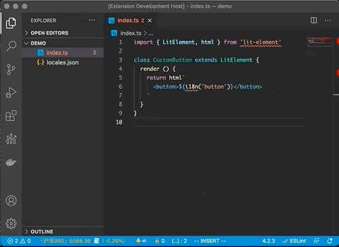
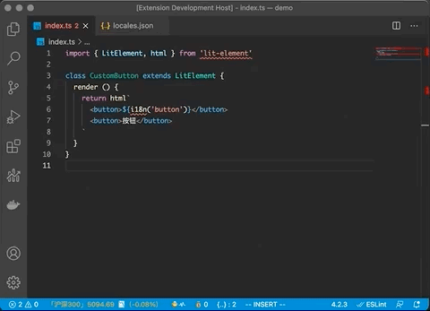

# Lit-i18n-tool

## Why

最近使用 [Lit-Element](https://lit-element.polymer-project.org/guide) 开发项目，并且项目有多语言的需求，中文文本都需要使用i18n函数去转换，如：

```typescript
class CustomButton extends LitElement {
  render () {
    return html`
      <button>按钮</button>
    `
  }
}

// 转换成
class CustomButton extends LitElement {
  render () {
    return html`
      <button>${i18n('button')}</button>
    `
  }
}

```

如果自己手动去转换i18n函数的话，工作量大并且可能过了一段时间，你自己也不知道这个i18n函数的与原始文案是什么，所以为了解决这个问题，就做了这么一个vscode插件。

## Basic Usage

选中需要修改的中文文本，右键菜单选择 **替换选择的文本** 或者使用快捷键 `Shift + Command + i`，会出现一个输入框，需要自己输入一个key用来标识当前中文文本，最后会在项目中生成一个`locales.json`文件用来记录，如：

```json
{
  "button": "按钮"
}
```

**生成key：**


**更新key：**


💡：*这只是一个小的工具，而不是一个多语言翻译平台*

## 🌈 Feature

- [x] 快速跳转，鼠标hover提示（能够快速追踪当前i18n函数中的key原始文案）
- [x] 快捷键支持
- [x] 自定义i18n函数名称
- [x] 自定义JSON文件存放位置
- [x] 遇到相同或者相似的文本会提供已有的翻译进行选择
- [x] 检查key是否在JSON文件中丢失
- [x] 更新key






## TODO

- [ ] 全文检索代码中存在的中文字符（过滤掉注释）
- [ ] 接入翻译平台
